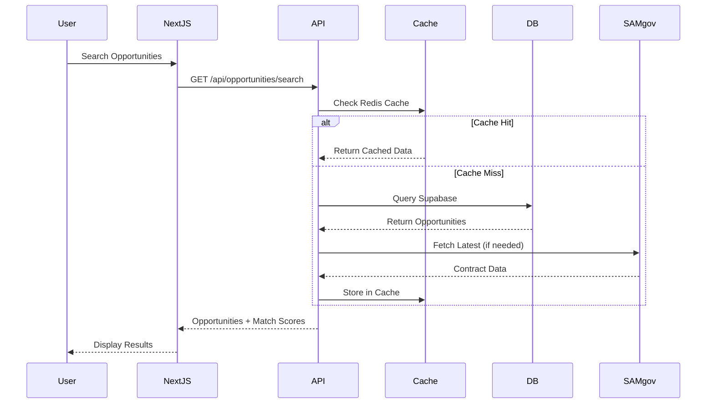
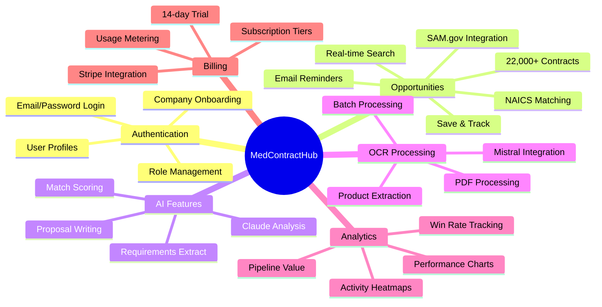

# MedContractHub Project Visualization

## 🏗️ Current Architecture Overview

```mermaid
graph TB
    subgraph "Frontend (Next.js App Router)"
        A[Landing Page] --> B[Auth Pages]
        B --> B1[Login]
        B --> B2[Signup]
        B --> B3[Onboarding]
        
        B --> C[Dashboard]
        C --> D[Opportunities]
        C --> E[Saved]
        C --> F[Proposals]
        C --> G[Analytics]
        C --> H[Settings]
        
        D --> D1[Search SAM.gov]
        D --> D2[View Details]
        D --> D3[Save/Track]
        
        F --> F1[Create Proposal]
        F --> F2[AI Assistance]
    end
    
    subgraph "API Layer"
        I[API Routes]
        I --> J[/api/opportunities]
        I --> K[/api/ai]
        I --> L[/api/billing]
        I --> M[/api/ocr]
        I --> N[/api/sync]
    end
    
    subgraph "External Services"
        O[SAM.gov API]
        P[Claude AI]
        Q[Mistral OCR]
        R[Stripe]
        S[Resend Email]
        T[Brave Search]
    end
    
    subgraph "Data Layer"
        U[Supabase]
        U --> U1[Auth]
        U --> U2[PostgreSQL]
        U --> U3[Storage]
        
        V[Redis Cache]
        W[Bull.js Queue]
    end
    
    J --> O
    K --> P
    M --> Q
    L --> R
    I --> S
    J --> T
    
    I --> U
    I --> V
    I --> W
```

## 📁 Current Directory Structure

```
medcontracthub/
│
├── 🎨 app/                        # Next.js 14 App Router
│   ├── (auth)/                    # Public auth routes
│   │   ├── login/                 # Login page + server actions
│   │   ├── signup/                # Registration
│   │   └── onboarding/            # Company setup wizard
│   │
│   ├── (dashboard)/               # Protected dashboard routes
│   │   ├── dashboard/             # Main dashboard (colorful gradients)
│   │   ├── opportunities/         # SAM.gov contract browser
│   │   ├── saved/                 # Saved opportunities
│   │   ├── proposals/             # Proposal management
│   │   ├── analytics/             # Business intelligence
│   │   ├── settings/              # User & billing settings
│   │   └── test-ocr/              # OCR testing interface
│   │
│   └── api/                       # API endpoints
│       ├── opportunities/         # Contract search & sync
│       ├── ai/                    # Claude integration
│       ├── ocr/                   # Mistral document processing
│       ├── billing/               # Stripe payments
│       └── webhooks/              # External service hooks
│
├── 🧩 components/                 # React components
│   ├── ui/                        # Base UI (shadcn/ui)
│   ├── dashboard/                 # Dashboard features
│   │   ├── opportunities/         # Opportunity components
│   │   ├── analytics/             # Charts & graphs
│   │   └── ocr/                   # Document processing
│   └── landing/                   # Marketing pages
│
├── 📚 lib/                        # Core libraries
│   ├── supabase/                  # Database clients
│   ├── sam-gov/                   # SAM.gov API client
│   ├── ai/                        # AI integrations
│   │   ├── claude-client.ts       # Claude API
│   │   └── mistral-ocr-client.ts  # Mistral OCR
│   ├── stripe/                    # Payment processing
│   ├── errors/                    # Error handling system
│   ├── queue/                     # Background job processing
│   └── monitoring/                # Sentry integration
│
├── 🆕 core/                       # New domain-driven structure
│   ├── contracts/                 # Opportunity domain
│   ├── users/                     # User management
│   └── billing/                   # Subscription logic
│
├── 🏭 infrastructure/             # Technical infrastructure
│   ├── cache/                     # Redis + in-memory
│   ├── database/                  # DB connections
│   └── monitoring/                # Logging & metrics
│
└── 🎯 features/                   # Feature modules
    ├── opportunities/             # Self-contained feature
    └── proposals/                 # Proposal feature
```

## 🔄 Data Flow Visualization



## 🎨 UI Component Hierarchy

```
Dashboard Layout
├── Sidebar (Gradient Logo)
│   ├── Navigation Links
│   │   ├── Dashboard (Blue gradient)
│   │   ├── Opportunities (Green gradient)
│   │   ├── Saved (Purple gradient)
│   │   └── Analytics (Orange gradient)
│   └── User Profile
│
├── Header
│   ├── Breadcrumbs
│   └── Quick Actions
│
└── Main Content Area
    ├── Page Header (Gradient Text)
    ├── Stats Cards (Colored gradients)
    │   ├── Total Opportunities
    │   ├── Your Matches
    │   ├── Saved Count
    │   └── Contract Value
    │
    ├── Filters Section
    │   ├── Search Bar
    │   ├── NAICS Filter
    │   ├── State Filter
    │   └── Date Range
    │
    └── Results List
        └── Opportunity Cards
            ├── Title & Agency
            ├── Value & Deadline
            ├── Match Score Badge
            └── Action Buttons
```

## 🚀 Key Features Map



## 💾 Database Schema Overview

```sql
-- Core Tables
opportunities (
    id, notice_id, title, agency,
    naics_codes[], response_deadline,
    value_amount, active
)

saved_opportunities (
    user_id, opportunity_id,
    notes, saved_at
)

profiles (
    id, email, company_id,
    onboarding_completed
)

companies (
    id, name, naics_codes[],
    certifications[], 
    employees_count
)

-- Feature Tables
proposals (
    id, opportunity_id, user_id,
    content, status, ai_assisted
)

contract_documents (
    id, opportunity_id,
    extracted_text, products[]
)

-- Analytics Tables
user_activity_logs (
    user_id, action, entity_type,
    metadata, created_at
)
```

## 🔧 Tech Stack Visualization

```
Frontend:
├── Next.js 14 (App Router)
├── TypeScript
├── Tailwind CSS
├── shadcn/ui Components
├── React Query
└── Framer Motion

Backend:
├── Next.js API Routes
├── Supabase (Auth + DB)
├── Redis (Caching)
├── Bull.js (Queues)
└── Node.js

External APIs:
├── SAM.gov (Contracts)
├── Claude (AI Analysis)
├── Mistral (OCR)
├── Stripe (Payments)
├── Resend (Email)
└── Brave (Search)

Monitoring:
├── Sentry (Errors)
├── Vercel Analytics
└── Custom Metrics
```

## 🎯 Current Status

```
✅ Completed Features:
- Authentication & Onboarding
- SAM.gov Integration (22k+ opportunities)
- AI Analysis with Claude
- OCR Document Processing
- Email Notifications
- Stripe Billing
- Colorful Dashboard UI
- Virtual Scrolling
- Advanced Search

🚧 In Progress:
- Architecture Migration
- Performance Optimization
- Test Coverage

📋 Planned:
- Real-time Updates
- Mobile App
- Advanced Analytics
- Team Collaboration
```

## 🌈 UI Design System

```
Color Palette:
- Blue (#2563eb): Opportunities
- Green (#059669): Saved/Success
- Purple (#7c3aed): Proposals
- Orange (#f59e0b): Analytics/Value
- Red (#dc2626): Errors
- Gray: Neutral UI

Gradients:
- Header: linear-gradient(#2563eb → #7c3aed)
- Cards: 135deg gradients with 10% opacity
- Buttons: Solid → gradient on hover

Components:
- Cards with hover shadows
- Gradient text headers
- Animated loading states
- Toast notifications
- Modal dialogs
```

This visualization shows how your MedContractHub project is structured, with clear separation between authentication flows, dashboard features, API integrations, and the new scalable architecture being implemented. The colorful UI with gradients is integrated throughout the dashboard for a modern, engaging experience.