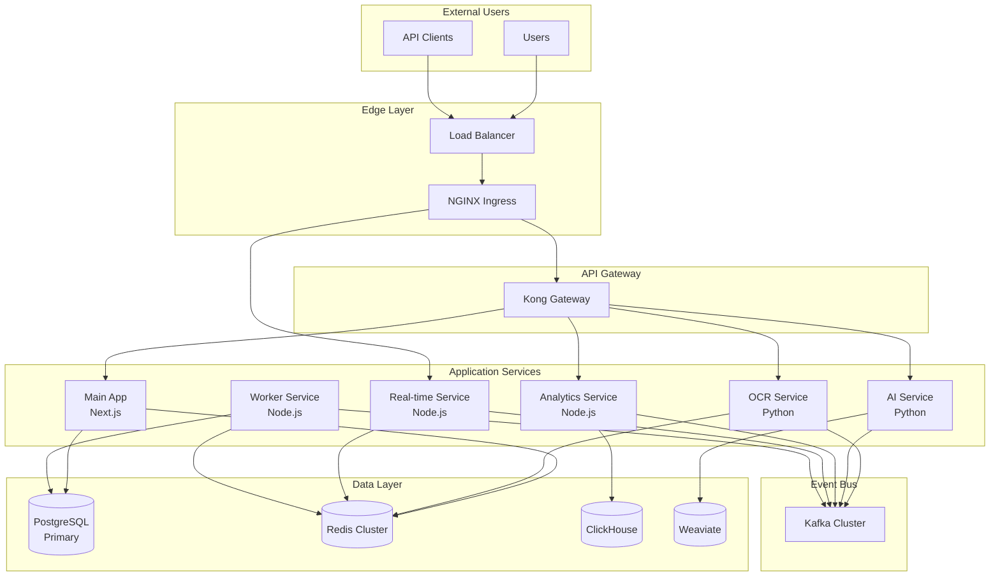

# MedContractHub Microservices Architecture

## Overview

MedContractHub has evolved from a monolithic Next.js application to a distributed microservices architecture designed for scalability, reliability, and performance. This document describes the architectural decisions, service interactions, and operational considerations.

## Architecture Principles

### 1. Domain-Driven Design
- Each microservice owns its domain and data
- Clear bounded contexts between services
- Event-driven communication for loose coupling

### 2. Event Sourcing
- All state changes captured as events
- Immutable event log in PostgreSQL
- Kafka for event distribution

### 3. CQRS (Command Query Responsibility Segregation)
- Write operations through PostgreSQL
- Read operations from specialized databases (ClickHouse, Weaviate)
- Eventually consistent views

### 4. Zero-Trust Security
- Network policies enforce strict access control
- mTLS between services via Istio
- API Gateway authentication

## Service Architecture



## Service Descriptions

### 1. Main Application (medcontracthub-app)
- **Technology**: Next.js 15, TypeScript
- **Responsibilities**:
  - User interface and experience
  - Authentication and authorization
  - API orchestration
  - Session management
- **Dependencies**: PostgreSQL, Redis, Kong Gateway

### 2. OCR Service
- **Technology**: Python, FastAPI, Tesseract, Mistral
- **Responsibilities**:
  - Document text extraction
  - PDF processing
  - Image analysis
  - Requirement extraction
- **Events Published**:
  - `DocumentProcessed`
  - `RequirementsExtracted`
- **Dependencies**: Kafka, Redis, S3

### 3. AI Service
- **Technology**: Python, FastAPI, Weaviate
- **Responsibilities**:
  - Multi-model AI orchestration
  - Semantic search
  - Proposal generation
  - Recommendation engine
- **Events Published**:
  - `AnalysisCompleted`
  - `ProposalGenerated`
- **Dependencies**: Weaviate, Kafka, External AI APIs

### 4. Analytics Service
- **Technology**: Node.js, TypeScript
- **Responsibilities**:
  - Event aggregation
  - Time-series analytics
  - Business metrics calculation
  - Dashboard data preparation
- **Events Consumed**: All domain events
- **Dependencies**: ClickHouse, Kafka

### 5. Real-time Service
- **Technology**: Node.js, Socket.IO
- **Responsibilities**:
  - WebSocket connections
  - Real-time notifications
  - Collaborative editing
  - Live dashboard updates
- **Dependencies**: Redis (Pub/Sub), Kafka

### 6. Worker Service
- **Technology**: Node.js, BullMQ
- **Responsibilities**:
  - Background job processing
  - Email sending
  - SAM.gov synchronization
  - Scheduled tasks
- **Dependencies**: Redis, PostgreSQL, External APIs

## Data Flow Patterns

### 1. Opportunity Processing Flow
```
1. Worker Service fetches from SAM.gov
2. Publishes OpportunityDiscovered event to Kafka
3. AI Service creates embeddings in Weaviate
4. Analytics Service records metrics in ClickHouse
5. Real-time Service notifies subscribed users
```

### 2. Document Analysis Flow
```
1. User uploads document via Main App
2. Main App stores in S3, queues OCR job
3. OCR Service processes document
4. Publishes DocumentProcessed event
5. AI Service analyzes content
6. Results stored and user notified
```

### 3. Proposal Generation Flow
```
1. User initiates proposal via Main App
2. AI Service retrieves relevant documents from Weaviate
3. Generates proposal using multi-model approach
4. Publishes ProposalGenerated event
5. Analytics records metrics
6. User receives notification
```

## Database Strategy

### PostgreSQL (Source of Truth)
- Transactional data
- Event store
- User/company data
- RLS for multi-tenancy

### Redis Cluster
- Session storage
- Rate limiting
- Caching layer
- Job queues (BullMQ)
- Real-time pub/sub

### ClickHouse (Analytics)
- Time-series data
- Aggregated metrics
- Historical analytics
- Materialized views for dashboards

### Weaviate (Vector Search)
- Document embeddings
- Semantic search
- AI model context
- Recommendation data

## Event-Driven Architecture

### Event Types
```typescript
// Base event structure
interface DomainEvent {
  eventId: string
  eventType: string
  aggregateId: string
  aggregateType: string
  eventData: object
  metadata: EventMetadata
  timestamp: string
}

interface EventMetadata {
  correlationId: string
  causationId: string
  userId?: string
  version: number
}
```

### Kafka Topic Structure
- `contracts.opportunities.events` - Opportunity lifecycle
- `contracts.proposals.events` - Proposal management
- `contracts.documents.events` - Document processing
- `contracts.analytics.events` - Analytics tracking
- `contracts.system.events` - System monitoring

### Event Ordering Guarantees
- Partition by aggregate ID
- Ordered processing within partition
- Idempotent consumers
- At-least-once delivery

## Security Architecture

### Network Security
- Default deny network policies
- Service-to-service mTLS via Istio
- Ingress TLS termination
- WAF rules at edge

### Authentication & Authorization
- JWT tokens via Supabase Auth
- Service accounts for inter-service communication
- RBAC policies in Kubernetes
- API key management via Kong

### Data Security
- Encryption at rest (RDS, S3)
- Encryption in transit (TLS 1.3)
- Secrets management via External Secrets Operator
- PII handling compliance

## Scalability Patterns

### Horizontal Scaling
- HPA with custom metrics
- Pod disruption budgets
- Anti-affinity rules
- Zone-aware deployments

### Performance Optimization
- Redis caching strategies
- Database connection pooling
- Async processing via Kafka
- CDN for static assets

### Load Balancing
- Service mesh load balancing
- Sticky sessions for WebSocket
- Circuit breakers
- Retry policies with backoff

## Monitoring & Observability

### Metrics (Prometheus)
- RED metrics (Rate, Errors, Duration)
- USE metrics (Utilization, Saturation, Errors)
- Business KPIs
- Custom application metrics

### Logging (Loki/Elasticsearch)
- Structured JSON logging
- Correlation IDs
- Log aggregation
- Retention policies

### Tracing (Jaeger)
- Distributed request tracing
- Service dependency mapping
- Performance bottleneck identification
- Error root cause analysis

## Deployment Strategy

### Progressive Rollout
- Canary deployments (10% → 50% → 100%)
- Blue-green deployments
- Feature flags
- Automated rollback

### Multi-Environment
- Development (hot reload, verbose logging)
- Staging (production config, test data)
- Production (HA, monitoring, backups)

### GitOps Workflow
- Infrastructure as Code
- Declarative configurations
- Automated sync via ArgoCD
- Version-controlled everything

## Disaster Recovery

### Backup Strategy
- PostgreSQL: Daily snapshots, PITR
- ClickHouse: Daily exports to S3
- Weaviate: Weekly backups
- Redis: AOF persistence

### RTO/RPO Targets
- RTO: 1 hour
- RPO: 15 minutes
- Automated failover
- Cross-region replication (future)

## Cost Optimization

### Resource Management
- Spot instances for workers
- Reserved instances for databases
- Autoscaling based on metrics
- Scheduled scaling for predictable loads

### Data Lifecycle
- Hot data: 30 days in Kafka
- Warm data: 90 days in ClickHouse
- Cold data: S3 Glacier
- Automated archival

## Future Considerations

### Phase 2 Enhancements
- GraphQL federation
- Service mesh migration to Istio
- Multi-region deployment
- Edge computing for OCR

### Technical Debt
- Migrate remaining monolith features
- Standardize logging format
- Implement distributed transactions
- Enhanced testing coverage

## Architecture Decision Records

### ADR-001: Microservices Migration
**Status**: Accepted  
**Context**: Monolith reaching scalability limits  
**Decision**: Migrate to microservices  
**Consequences**: Increased complexity, better scalability

### ADR-002: Event Sourcing
**Status**: Accepted  
**Context**: Need audit trail and event replay  
**Decision**: Implement event sourcing with Kafka  
**Consequences**: Eventually consistent, complex queries

### ADR-003: Multi-Model AI
**Status**: Accepted  
**Context**: Single AI model insufficient  
**Decision**: Orchestrate multiple AI providers  
**Consequences**: Higher cost, better results

## References

- [Kubernetes Configurations](../../k8s/)
- [Service Documentation](./services/)
- [API Specifications](./api/)
- [Runbooks](./runbooks/)